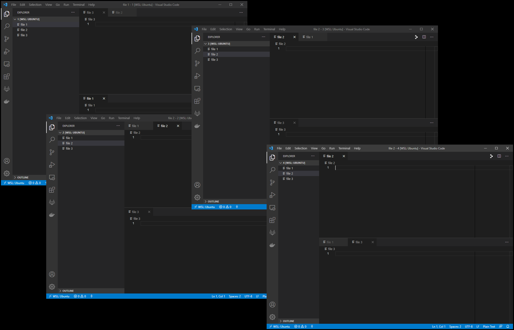
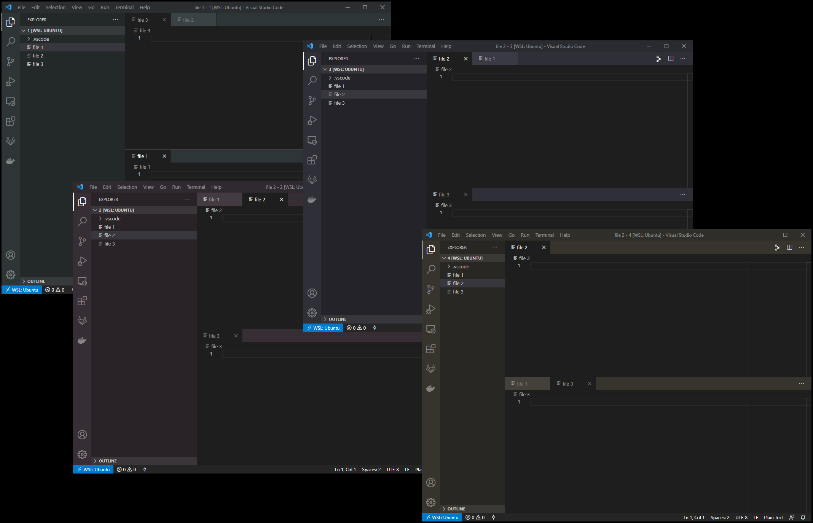

# vscode-colorgen

Do you open multiple Visual Studio Code projects? Do you also have a hard time finding the one you need in the sea of dull gray windows?  Tint each of your projects by adding random colors to workbench customizations!

## Before `vscode-colorgen`




## After `vscode-colorgen`



# Install

This project uses python venv.  The easy way to make use of the script is recreate the environment:

1. Clone this repo
2. `pip install -r requirements.txt`

# Build
`pyinstaller --onefile vscode-colorgen.py`

# Usage

In `vscode-colorgen.py` are variables `s, l, lighten/darken_factor`.  These control the vibrance, brightness and variation in colors. vscode-colorgen will generate a random hue and apply those values to create these settings.json key/values.  Your existing .vscode/settings.json is read in and deep merged with these settings.

```
{
  "workbench.colorCustomizations": {
    "tab.inactiveBackground": "#443A3F",
    "titleBar.activeBackground": "#372E32",
    "activityBar.background": "#372E32",
    "editorGroupHeader.tabsBackground": "#372E32",
    "sideBar.background": "#292326",
    "statusBar.background": "#252526"
  }
}
```